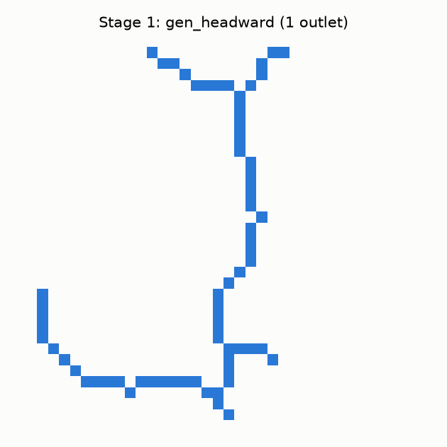
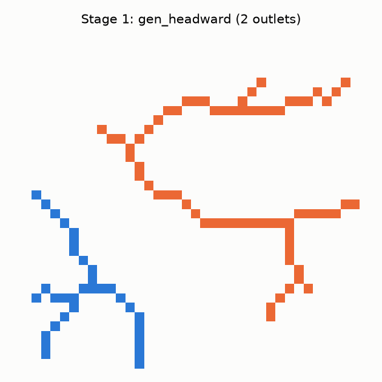
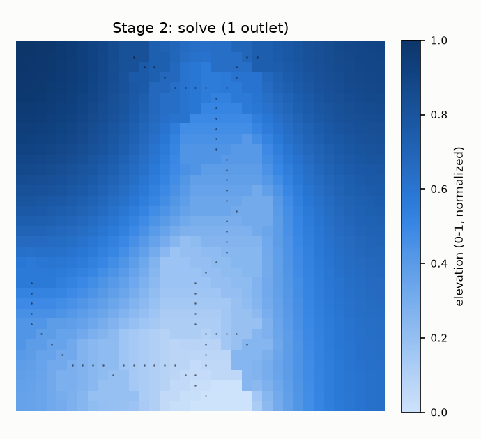
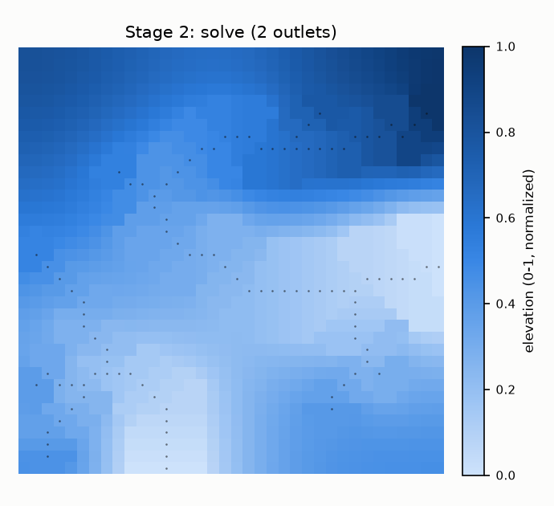
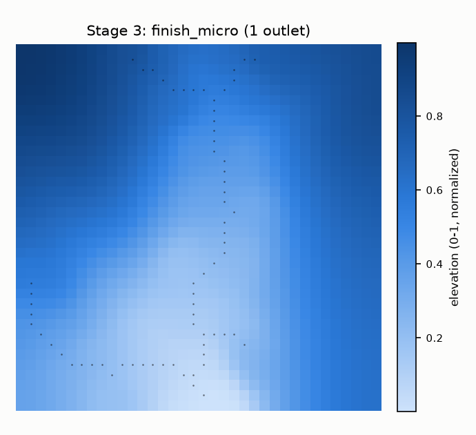
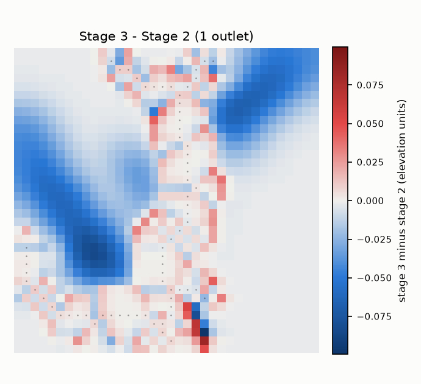
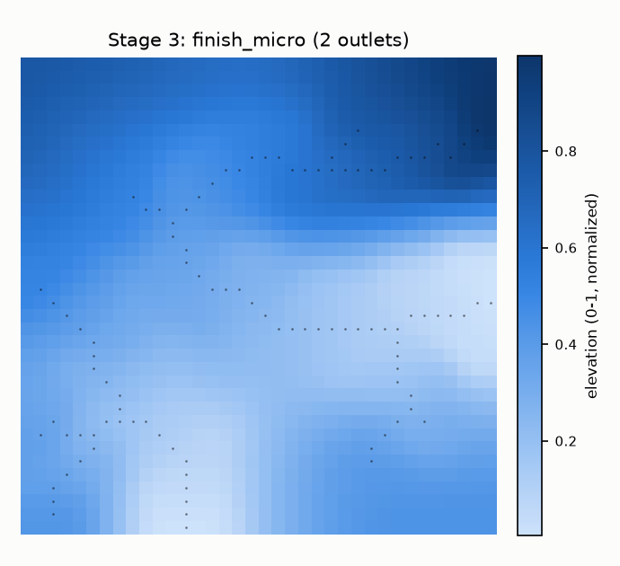
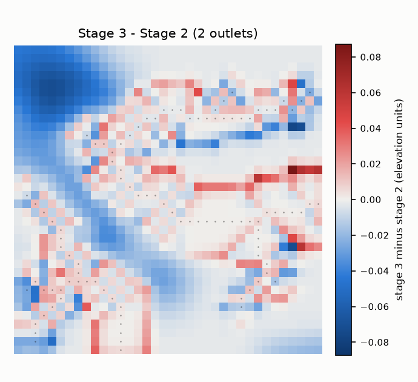

# 使い方

このドキュメントは、実際にコードを動かして確認したことだけを書く。動かしていない主張は「未検証」と明記する。

## 進捗

| 段 | 関数 | 状態 |
|---|---|---|
| 第1段（水系を描く） | `experiments.mini.gen_headward` | 動作確認済み（2026-09-27） |
| 第2段（面を起こす） | `experiments.mini.solve` | 動作確認済み・既知の問題を修正（2026-09-27。下記「既知の問題」参照） |
| 第3段（仕上げ） | `experiments.mini_finish.finish_micro` | 動作確認済み（2026-09-27。下記「第3段」参照。「削るだけ」という主張に例外あり） |
| 正準の入口 | `experiments.baseline.generate` | 未検証（凍結ゼロの再現に問題あり。下記「環境と既知の問題」参照） |

## 環境

```bash
python -m venv .venv
.venv\Scripts\pip install -r requirements.txt
```

このリポジトリで実際に確認した組み合わせ:

- Python 3.14.7、numpy 2.5.3、scipy 1.18.1、scikit-image 0.26.0、matplotlib 3.11.2

`experiments/baseline.py` のコメントが指定する、開発時に検証された組み合わせ:

- Python 3.11.15、numpy 2.4.6、scipy 1.17.1、scikit-image 0.26.0、matplotlib 3.11.2

### 環境と既知の問題

`generate()` の「何度呼んでもビット単位で同じものを返す」という設計は、次のコマンドで検証できる。

```bash
python -m experiments.baseline --check
```

開発時に検証された組み合わせ（上記）では `max |u - golden| = 0.00e+00` が確認されている。

**この環境（numpy 2.5.3 / scipy 1.18.1 / Python 3.14.7）で実行すると、`max |u - golden| = 5.28e-02` となり、一致しない。** 原因は未調査。`scipy.ndimage.distance_transform_edt` など、内部で使う数値計算ルーチンのバージョン差が候補として考えられるが、切り分けていない。

`generate()` を使う際は、この既知の問題を踏まえること。第1段（`gen_headward`）単体は、この環境でも実行でき、後述のとおり実用上問題のない結果が得られている。

---

## 図の作り方

以下の図はすべて `matplotlib` で作った。ユーザーが自分のデータを見るときの参考として、使った関数をそのまま載せる。

```python
import numpy as np
import matplotlib.pyplot as plt
from matplotlib.colors import LinearSegmentedColormap

# 第1段(gen_headward)の出力: bool 配列 net、int16 配列 lab を色分けする
def plot_net(net, lab, title):
    if lab is None:
        rgb = np.where(net[..., None], np.array([0x2a, 0x78, 0xd6]) / 255.0,
                       np.array([0xfc, 0xfc, 0xfb]) / 255.0)
    else:
        colors = {0: "#fcfcfb", 1: "#2a78d6", 2: "#eb6834"}  # land, basin 1, basin 2
        rgb = np.zeros(net.shape + (3,))
        for k, hexcode in colors.items():
            rgb[lab == k] = np.array([int(hexcode[i:i+2], 16) for i in (1, 3, 5)]) / 255.0
    fig, ax = plt.subplots(figsize=(4.2, 4.2))
    ax.imshow(rgb, interpolation="nearest")
    ax.set_xticks([]); ax.set_yticks([])
    ax.set_title(title)
    fig.savefig("net.png", facecolor="#fcfcfb")

# 第2段(solve)の出力: float64 配列 u(標高)を連続カラーマップで表示し、川を重ねる
SEQ_BLUE = LinearSegmentedColormap.from_list("seq_blue", [
    "#cde2fb", "#b7d3f6", "#9ec5f4", "#86b6ef", "#6da7ec", "#5598e7",
    "#3987e5", "#2a78d6", "#256abf", "#1c5cab", "#184f95", "#104281", "#0d366b",
])

def plot_elev(u, net, title):
    fig, ax = plt.subplots(figsize=(4.6, 4.2))
    im = ax.imshow(u, cmap=SEQ_BLUE, interpolation="nearest")
    ry, rx = np.where(net)
    ax.scatter(rx, ry, s=1.5, c="#0b0b0b", alpha=0.55, linewidths=0)  # 川を重ねる
    ax.set_xticks([]); ax.set_yticks([])
    ax.set_title(title)
    fig.colorbar(im, ax=ax, label="elevation (0-1, normalized)")
    fig.savefig("elev.png", facecolor="#fcfcfb")
```

配色は `dataviz` スキル（バリデータ `validate_palette.js`）で検証済みのもの: 流域の色分け（青 `#2a78d6` / 橙 `#eb6834`）は色覚多様性のもとでも判別できる組み合わせとして確認した。標高は単一色（青）の連続カラーマップにしている。

---

## 第1段 — `gen_headward`（水系を描く）

```python
def gen_headward(rng, n=128, ell=5.0, ..., roots=None, shape=None,
                 labels=False, domain=None, ...)
```

必須は乱数生成器 `rng` だけ。残りは全部省略できる。

主な引数:

| 引数 | 意味 |
|---|---|
| `n` | 正方形の一辺（px）。`shape` を指定すると無視される |
| `shape=(H, W)` | 長方形にしたい場合の大きさ |
| `roots` | `(行, 列, 向き)` のリスト。水の出口（省略時は下辺中央に1つ） |
| `domain` | bool 配列。True が陸。省略すると長方形全面が陸になる |
| `reserve` | bool 配列。川を生やしてはいけない場所 |
| `labels` | **常に `True` を渡すこと。** 第2段 `solve` に渡す `lab` を得るために必要 |

戻り値（`labels=True` で呼んだ場合）:

`(net, lab)` のタプル。`net` は bool 配列で、川なら `True`。`lab` は int16 配列で、`-1` = 陸の外、`0` = 陸だが川ではない、`k > 0` = k 番目の出口に注ぐ川。

標高はこの関数の入力に無い。地形を見て川を引いているのではなく、白紙に川を引いている。

### 例1：出口1つ

```python
import numpy as np
from experiments.mini import gen_headward

net, lab = gen_headward(np.random.default_rng(3), n=36, labels=True)
```



### 例2：出口を2つ置き、流域も返させる

```python
roots = [(35, 12, -np.pi/2),   # 下辺  → 上へ遡る
         (18, 35,  np.pi)]     # 右辺  → 左へ遡る
net, lab = gen_headward(np.random.default_rng(5), n=36, roots=roots, labels=True)
```

`roots` は `(行, 列, 向き)`。向きは水が流れる方ではなく、木が伸びる方＝上流方向。`lab` の実際の値は `{0, 1, 2}`。



流域1（青）と流域2（橙）が混ざらず、あいだに何も無い帯（＝分水界）ができている。この分け方を `lab` として第2段に渡す。

**注記。** この結果は、同じシード・同じ引数で以前得られていた記録とほぼ同じ地形の骨格になったが、数ピクセル分だけ経路が異なった。前述の環境差（numpy/scipy のバージョン）が原因と見ているが、確認していない。

---

## 第2段 — `solve`（面を起こす）

```python
def solve(net, tilt=None, poisson=0.006, theta=0.3, cap_px=0.0, floor_px=4.0,
          outlets=None, acc_ref=None, bow=0.0, floor_mul=1.0, cone=True,
          floor_tilt=0.0, hollow_px=0.0, labels=None)
```

第1段が返す `net`（1px の川のラスタ）を受け取り、標高の面を返す。

主な引数:

| 引数 | 意味 |
|---|---|
| `net` | 第1段の出力（bool 配列） |
| `outlets` | `(行, 列)` のリスト。第1段で使った `roots` の座標をそのまま渡す |
| `labels` | **常に渡すこと。** 第1段から `labels=True` で受け取った `lab` をそのまま渡す |
| `theta` | 川の縦断形状の凹み具合（Flint の法則の指数） |
| `poisson` | 丘を下から押し上げる強さ。0 だと谷の間の面は単なる調和補間（膜を張っただけ）になり、丘が川の高さを超えられない |
| `floor_px` | 谷底の幅 |

戻り値は `float64` の2次元配列（`net` と同じ形）。値は `[0, 1]` に正規化されている。`0` が最も低い（出口の高さ）。

### 既知の問題：川が谷底にない（2026-09-27, 2回の修正を経て解消）

最初に作った版では、川セル（`net==True`）の標高が、隣接する陸セルより**高い**ことが大半だった。原因は、`solve()` が縦断標高を「1px の川」ではなく「川を1px 太らせた帯」の上で計算していたこと。帯の脇のセルは、曲がり角で本来の川の経路をショートカットでき、集水量も別物になるため、勾配の計算が本来の川とずれる。

**1回目の修正。** 縦断標高（測地距離・集水量・Flint則の積分）を1px の `net`（＋頭部延長）だけで計算し、帯の脇のセルは最も近い川セルの標高をそのまま塗るように変更した。谷底の幅（`floor_px`）は、1px の川だけでは集水量が小さすぎて較正が崩れるため、幅の計算だけは元どおり太い帯の集水量を使い、川セル側にその幅を持たせ直している。

**検証で使った指標が途中で変わった経緯。** 最初、こちらで独自に「8近傍のうち自分が最下位か」という厳しい基準で検査したところ、修正後も76〜79%が違反という結果になり、「直っていない」と判断していた。だが、これは基準が厳しすぎた（実物の地形でも通らない水準の基準だった）。開発環境が実際に使っていたのは別の指標で、「最寄りの川セルより、比高0.5%以上低い陸セルの割合」を、川からの距離帯（1〜1.5px、2〜4px）ごとに測るというもの。この指標で測り直すと、開発環境の報告とほぼ一致した:

| 距離帯 | 開発環境の報告（修正前→後、実物） | このリポジトリでの実測（seed 1-3, n=128） |
|---|---|---|
| 1〜1.5px | 43% → 約1%（実物 7%） | 0.5〜0.9% |
| 2〜4px | 23% → 約6%（実物 1%） | 8.4〜8.8% |

**2回目の修正（2026-09-27 追加）。** 谷底（`floor_px`）を塗る際、コード内コメントによれば「谷底の位置はコーン(`cone_floor`)の持ち主で決めるが、その z は最寄りの川セルではなく、コーンの持ち主(たいてい下流側の太い本流)から取っていた」ため、川のすぐ脇の谷底が、その川セル自身より低く塗られることがあった(コード内の実測: 川セルの約10%が自分の横断面より高い状態。修正後は約6%、実物の川内は1%)。谷底の z を、コーンの持ち主ではなく最寄りの1px川セルから取るように直した。

### 例1：出口1つ（第1段の続き）

```python
from experiments.mini import gen_headward, solve
import numpy as np

net, lab = gen_headward(np.random.default_rng(3), n=36, labels=True)
u = solve(net, outlets=[(34, 18)], labels=lab)   # n=36 の既定の出口は (n-2, n//2) = (34, 18)
```



実際の値（`u.min()` = 0.0、`u.max()` = 0.9999999999991799、NaN 無し）。出口 `(34, 18)` の周辺が最も低く（明るい色）、地図の縁に近づくほど高くなる（濃い色）。川が1本しかない場合は、分水界（等距離の帯）が生まれる場所が無く、面全体がひとつの丘としてなだらかに盛り上がる。

### 例2：出口を2つ

```python
from experiments.mini import gen_headward, solve
import numpy as np

roots = [(35, 12, -np.pi/2),
         (18, 35,  np.pi)]
net, lab = gen_headward(np.random.default_rng(5), n=36, roots=roots, labels=True)
u = solve(net, outlets=[(r, c) for (r, c, _a) in roots], labels=lab)
```



実際の値（`u.min()` = 0.0、`u.max()` = 0.9999999999990007、NaN 無し）。出口の座標（`(35,12)` と `(18,35)`）の周辺で値が最も低くなっており、外側に向かって高くなっている。色の変化はなめらかで、丘の頂上が個々の川から等距離の場所に自然に現れている（ドラフトにあった「尾根は描いていない」という主張どおりの挙動）。

---

## 第3段 — `finish_micro`（仕上げ）

```python
def finish_micro(u, net, rng, spacing=3.0, depth0=0.13, width=2.4,
                 rel_frac=0.6, smooth=1.5, max_steps=70, max_cuts=None,
                 refresh=12, final_sigma=0.9, domain=None)
```

第2段が返す `u`（面）と第1段の `net`（1px の川）を受け取り、丘の斜面に細かい刻みを入れる。設計上の主張は一つだけ：

> **この段は、削ることしかしない。しかも水の通り道に沿ってだけ。**

主な引数:

| 引数 | 意味 |
|---|---|
| `u` | 第2段の出力（面） |
| `net` | 第1段の出力。どこを刻んでよいかの判断に使う |
| `rng` | 乱数生成器。第1段で使ったものをそのまま引き継ぐ（新しく作り直さない） |
| `spacing` | 刻みを入れる間隔（px）。この間隔より水の通り道から遠い場所が無くなるまで繰り返す |
| `depth0` | 刻みの深さの上限 |
| `max_cuts` | 削る回数の上限。既定 `None` は地図の面積に比例して決める（`generate()` と同じ規則。128×128 で500、36×36 なら約39） |
| `final_sigma` | 最後にかける、ごく弱いぼかしの強さ |
| `domain` | bool 配列。陸の形（省略すると長方形全面） |

戻り値は `u` と同じ形の `float64` 配列。

### 実験：第2段の出力2つをそのまま通す

```python
from experiments.mini import gen_headward, solve
from experiments.mini_finish import finish_micro
import numpy as np

rng = np.random.default_rng(3)
net, lab = gen_headward(rng, n=36, labels=True)
u = solve(net, outlets=[(34, 18)], labels=lab)
u_finished = finish_micro(u, net, rng)   # rng は gen_headward と同じものを渡す
```




同じことを、出口2つの地形にも行った。




実際の値（2026-09-27、`finish_micro` の2回目の修正後に再実験）:

| | 出口1つ | 出口2つ |
|---|---|---|
| 第2段 min / max / mean | 0.0000 / 1.0000 / 0.5254 | 0.0000 / 1.0000 / 0.4086 |
| 第3段 min / max / mean | 0.0005 / 0.9980 / 0.5139 | 0.0042 / 0.9973 / 0.4020 |
| 差分（第3段−第2段）min / max | -0.0995 / +0.0824 | -0.0750 / +0.0872 |

**前回指摘した「最小値が第2段の全体最小(出口の高さ)を下回る」問題は直った。** 両方とも第3段の最小値が0以上になっている(0.0005、0.0042)。開発環境のコード変更を見ると、「刻みは、それが注ぐ先(川、または別の刻み)の標高より深く削ってはいけない」というルール(`dj = min(dj, max(u[path[j]] - u[path[-1]], 0.0))`)を追加していた。水の通り道が、自分の注ぎ先より低くなることはもう無い、という理屈で、実測とも合っている。

**ただし、差分の最大値(正の側)はむしろ大きくなった**(+0.045→+0.082、+0.047→+0.087)。これは既定どおりで、開発環境のコード変更を見ると意図的。「川から4px以内の陸地は、最寄りの川セルより低く削ってはいけない」というルールを追加しており(コード内コメントの実測: このルールが無いと川セルの約58%が周囲の地面より高い状態になる。実物の川内は0.4%。このルールを入れると約15%、`solve` 単体では約14%)、これは削るのではなく**周囲の地面を持ち上げて**川との整合を取る仕組みなので、差分マップの赤い部分(押し上げられた場所)は増える。差分マップ(2枚目・4枚目)でも、川のすぐ脇に赤い帯がはっきり見えるようになった。

**まだ切り分けていないこと。** 最終段の「ごく弱いぼかし」と「窪地の穴埋め」も、周囲の高い斜面と平均するため、川から4px より外側でも標高を押し上げることがありうる。今回の差分マップにも、川から離れた場所に散発的な赤が残っている。これがぼかし由来か、他の要因かは切り分けていない。

**検査方法についての追記。** 「川セルが8近傍のうち最下位か」という、こちらが最初に使った指標は、この修正後の版では**100%が「違反」**という結果になった。これは指標そのものが役に立たなくなったサインで、「川のすぐ脇の地面は川より低く削ってはいけない」というルールが入った結果、川セルとその隣接セルの標高がほぼ同値(浮動小数点の丸め程度の差)になる場面が増えたため。この指標はここでは使わないことにした。
